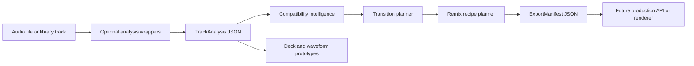
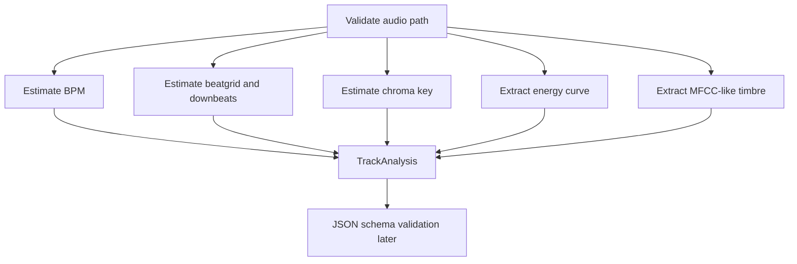
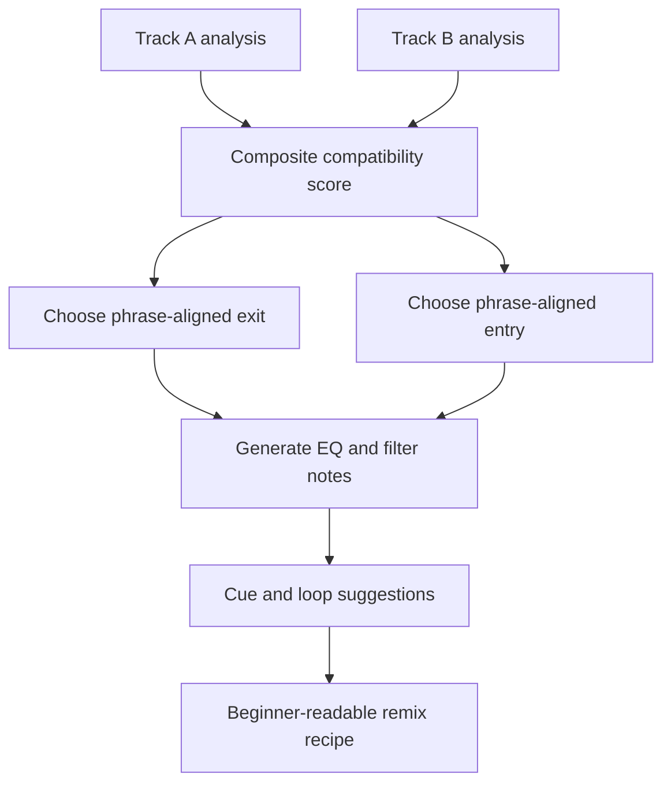
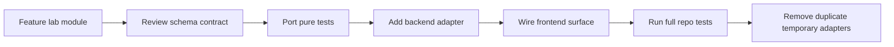

# Architecture

The feature lab is layered so each piece can be tested before integration. Schemas define contracts, TypeScript and Python models mirror them, pure intelligence modules operate on those models, prototypes render typed state, and IO helpers export reproducible JSON plans.

## Layers

- Audio analysis layer: optional wrappers for BPM, beatgrid, chroma key, MFCC, energy, sections, stems, and waveform summaries. Heavy dependencies are imported inside functions.
- Feature store layer: JSON-serializable `TrackAnalysis`, `StemManifest`, and `ExportManifest` objects that can later map to SQLite or existing metadata files.
- Compatibility intelligence layer: deterministic BPM, key, energy, timbre, and vocal clash scoring combined into a transparent score.
- Audio playback layer: deliberately not implemented here; primitives expose math that future Web Audio or Python renderers can consume.
- Deck state layer: `DeckState` captures loaded track, transport, tempo, key lock, cue, loop, and sync settings.
- Mixer state layer: `MixerState` captures channels, EQ, filters, crossfader, and master gain.
- Waveform visualization layer: prototype components render peaks, playhead, cues, beat/downbeat hints, and loop ranges.
- Remix planning layer: transition planner and recipe planner produce actionable steps with warnings.
- Export layer: manifests and JSON helpers preserve plan, source metadata, generated files, and validation state.

## Full System Data Flow

## Track Analysis Flow

## Transition Planning Flow

## Future Integration Flow

## Safe Boundaries

The lab code has no imports from the existing app. Future production integration should use adapters so current endpoints, stores, and UI components are not rewritten in one step.
