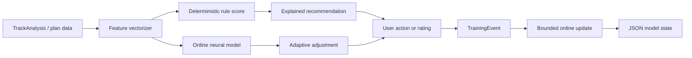

# Neural Learning Plan

This lab adds neural learning as an adaptive layer beside the deterministic remix intelligence. The deterministic rules remain the default explanation engine. Neural models learn only from explicit training events such as user ratings, accepted/rejected transition plans, corrected cues, corrected BPM/key metadata, or post-render quality labels.

## Safety Constraints

- No background training loop.
- No self-modifying code.
- No network calls.
- No heavyweight dependency required for base tests.
- No writes outside `ai_remixmate_feature_lab/`.
- Every update must come from a `TrainingEvent` with a feature name, bounded input vector, bounded target vector, source, and timestamp.
- Models persist only as JSON weight state.

## Feature Models

The neural registry creates one small online MLP per adaptive feature:

| Feature model | Learns from | Output meaning |
|---|---|---|
| `bpm_compatibility` | User correction of tempo blend quality | Tempo blend score |
| `key_compatibility` | Harmonic accept/reject feedback | Harmonic score |
| `energy_compatibility` | Energy flow ratings | Energy blend score |
| `timbre_compatibility` | Sonic texture ratings | Timbre score |
| `vocal_clash_risk` | Vocal conflict labels | Vocal clash risk |
| `compatibility_score` | Overall transition ratings | Composite score |
| `transition_planning` | Accepted/rejected cue timing | Entry/exit confidence |
| `remix_recipe_quality` | Recipe usefulness rating | Recipe quality score |
| `automix_next_track` | Set-order approval | Next-track confidence |
| `track_match` | Recommendation click/skip feedback | Match relevance |
| `beatgrid_confidence` | Manual beatgrid correction labels | Beatgrid confidence |
| `stem_quality` | Stem quality/bleed labels | Stem usefulness |
| `waveform_interest` | User jumps/cue placements | Section salience |

## Architecture

## Online Learning Strategy

Each model is a tiny fully connected neural network with one hidden layer, sigmoid outputs, deterministic initialization, and mean-squared-error gradient updates. This is intentionally smaller than a production ML system. The goal is to prove the contracts, feedback loop, persistence, and testability before using PyTorch or a larger model.

## Validation

- Unit tests verify prediction ranges, loss reduction, registry coverage, vectorizer dimensions, bounded update behavior, and JSON persistence.
- The existing deterministic tests continue to run.
- Future production integration should log neural suggestions separately from rule-based explanations until enough labeled examples exist.

## Future Integration

1. Add UI controls for explicit feedback: useful/not useful, cue accepted, cue moved, key corrected, vocal clash heard.
2. Store `TrainingEvent` records through a backend route.
3. Run online updates in a controlled job, not inside request handlers.
4. Compare rule-only versus rule-plus-neural outcomes before enabling neural adjustments by default.
